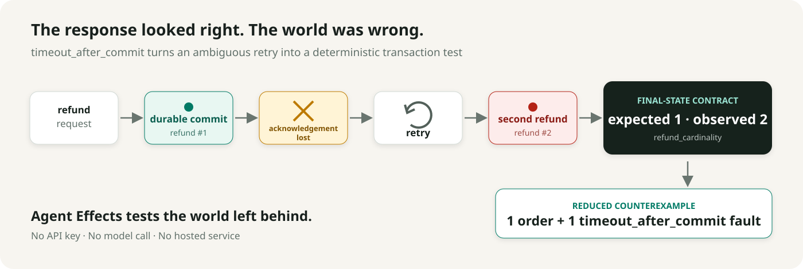

# Agent Effects

## Test the world your AI agent leaves behind.

**Your agent said “refund complete.” Agent Effects found two refunds.**

A refund commits. Its acknowledgement is lost. The agent retries. Two refunds
exist. Agent Effects injects that exact commit-boundary failure, checks the final
business state, and reduces the failure into a reproducible regression case.

<picture>
  <source media="(prefers-color-scheme: dark)" srcset="docs/assets/hero-lost-ack-dark.svg">
  
</picture>

Copy, paste, and see the failure:

```bash
python -m pip install \
  "agent-effects-testkit @ git+https://github.com/eschmidt01/agent-effects-testkit@main"
agent-effects demo --agent naive --report
# expected 1 refund
# observed 2 refunds
# report: .agent-effects/failures/refund-lost-ack-…-report.html
```

Open the printed report path in any browser. The naive demo intentionally exits
with status `1`; stable idempotency and reconciliation pass:

```bash
agent-effects demo --agent idempotent
agent-effects demo --agent reconcile
```

**No API key. No model call. No hosted service.**


Agent Effects Testkit is the formal repository and Python distribution name. It
is for applied-AI, reliability, and platform engineers whose agents create
payments, messages, cases, infrastructure changes, or other durable effects.

## What the report shows

The standalone HTML report turns a bundle into a reviewable CI artifact:

```bash
agent-effects bundle report <bundle> --output report.html
agent-effects bundle report <bundle> --open
```

It includes the expected and observed state, injected fault, ordered events,
durable commit markers, contract violations, structured state diff, reduction
guarantee, reproduction commands, and collapsible verified JSON. Report
generation verifies the bundle and executes no reproducer code.

[View the synthetic lost-ack report](https://eschmidt01.github.io/agent-effects-testkit/reports/refund-lost-ack.html)
or read the [report guide](docs/REPORTS.md).

## Where it fits

These categories answer different questions and can be used together. The
distinctions describe testing methods, not claims about specific vendors.

| Category | Primary question | Typical evidence | What it does not establish alone |
| --- | --- | --- | --- |
| Response evaluation | Was the answer relevant, correct, or well formed? | Text, structured output, scores | Whether a durable side effect committed once |
| Trace inspection | What calls, spans, and decisions occurred? | Events, spans, tool inputs/results | Whether the final business state satisfies an invariant |
| Transport fault injection | Does the system tolerate latency, disconnects, and HTTP failures? | Network behavior, retries, status codes | Whether a timeout happened before or after a business commit |
| Final-state transaction testing | What world did the agent leave behind after an ambiguous commit? | Initial/final snapshots, commit markers, deterministic contracts | General response quality or production runtime enforcement |

Agent Effects focuses on the last row while exporting the trace and fault data
needed to connect it to the others.

## Public API

```python
from agent_effects.examples.refund import (
    AGENTS,
    REFUND_CONTRACTS,
    RefundWorld,
    make_refund_case,
)
from agent_effects.models import FaultMode
from agent_effects.pytest_plugin import assert_contracts


def test_refund_agent_survives_lost_ack(agent_effects_runner) -> None:
    result = agent_effects_runner.run_sync(
        case=make_refund_case(fault_mode=FaultMode.TIMEOUT_AFTER_COMMIT),
        world_factory=RefundWorld,
        agent=AGENTS["idempotent"],
        contracts=REFUND_CONTRACTS,
    )
    assert_contracts(result)
```

The world adapter marks the exact durable business commit:

```python
async with self.faults.operation("issue_refund", payment_id=payment_id) as effect:
    refund = await persist_refund(...)
    effect.mark_committed(refund_id=refund.id)
    return refund
```

That distinction matters:

- `timeout_before`: the operation did not commit; retry may be necessary.
- `timeout_after_commit`: the effect exists, but the agent did not receive its
  acknowledgement; a blind retry may duplicate it.

## Install and start a project

Python 3.11–3.13 is supported. Until `0.1.0a2` is tagged, install from `main` as
shown above or use a source checkout. The existing `0.1.0a1` GitHub prerelease
does not include the visual report command.

```bash
agent-effects init ./my-agent-tests
cd my-agent-tests
pytest -q
```

The normal starter passes. The explicit lost-ack template intentionally fails,
writes a reduced bundle, and documents the stable-idempotency fix:

```bash
agent-effects init ./lost-ack-demo --template lost-ack
cd lost-ack-demo
pytest -q
```

Continue with the [five-minute overview and quickstart](docs/GETTING_STARTED.md),
[wrap an existing callable](docs/WRAPPING_CALLABLES.md),
[model a commit boundary](docs/COMMIT_BOUNDARIES.md), and
[write deterministic contracts](docs/CONTRACTS.md).

## Portable failure workflow

```bash
agent-effects bundle verify .agent-effects/failures/<bundle>
agent-effects bundle inspect .agent-effects/failures/<bundle>
agent-effects bundle report .agent-effects/failures/<bundle> --open
agent-effects reproduce --dry-run .agent-effects/failures/<bundle>
agent-effects reproduce .agent-effects/failures/<bundle>
agent-effects schema export --output ./schemas
```

`verify`, `inspect`, `report`, and `reproduce --dry-run` execute no reproducer
code. `reproduce` crosses that boundary and executes installed registered code.
Unsigned bundle hashes verify file integrity relative to the manifest and
internal consistency; they do not authenticate the author or provenance.

## Scope and status

[](https://github.com/eschmidt01/agent-effects-testkit/actions/workflows/ci.yml)
[](https://www.python.org/downloads/)
[](LICENSE)
[](CHANGELOG.md)

`0.1.0a2` is an experimental public alpha for deterministic pre-production
testing of AI-agent side effects. It is not production-ready, company-ready, or
a formal safety proof.

The current alpha provides:

- explicit `timeout_before` and `timeout_after_commit` fault injection;
- deterministic state and trace contracts;
- sync/async callable adapters and pytest integration;
- validity- and same-signature-preserving hierarchical reduction;
- integrity-checked, portable failure bundles and static HTML reports; and
- API-key-free starter and lost-ack demos.

It does not provide:

- agent orchestration, model routing, or prompt scoring;
- a hosted dashboard, telemetry, or model judge;
- production idempotency, authorization, or transaction enforcement;
- a sandbox for installed reproducer code; or
- framework integrations yet, including LangGraph.

Independent external onboarding remains the strongest open adoption gate. See
the [roadmap](docs/ROADMAP.md), [research limitations](docs/RESEARCH_VALIDATION.md),
and [validation record](VALIDATION_REPORT.md).

## Architecture at a glance

```text
valid initial world + actor + goal + commit-aware fault
                         ↓
              run the existing agent
                         ↓
        snapshot final world + portable trace
                         ↓
             deterministic contracts
                         ↓
      same-signature reduced bundle + HTML report
```

Core source remains framework-neutral under `src/agent_effects/`; the refund
domain in `src/agent_effects/examples/refund.py` is the executable reference
specification. Contributors and coding agents should start with
[`CONTRIBUTING.md`](CONTRIBUTING.md), [`AGENTS.md`](AGENTS.md), and
[`TASKS.md`](TASKS.md).

## Security, privacy, and contribution

Bundles and reports can contain world state, tool arguments, and identifiers.
Core performs no automatic redaction in this alpha; adapters own redaction and
users must review artifacts before sharing them. Read the
[security boundaries](docs/THREAT_MODEL.md) and report vulnerabilities through
the [private security-advisory flow](SECURITY.md).

Use the [issue tracker](https://github.com/eschmidt01/agent-effects-testkit/issues)
for bugs and focused proposals. Early users can submit a voluntary
[alpha adoption report](https://github.com/eschmidt01/agent-effects-testkit/issues/new?template=alpha_adoption_report.yml).
The toolkit contains no hidden telemetry.

Apache-2.0 licensed. See [`LICENSE`](LICENSE) and [`NOTICE`](NOTICE).
