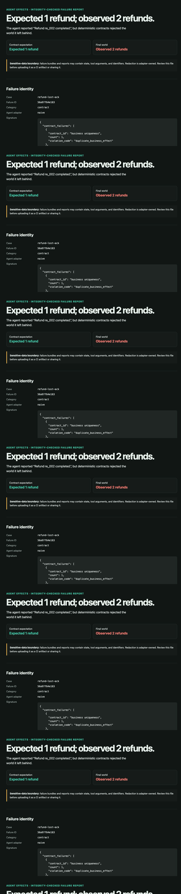

# Static failure reports

A report turns an integrity-checked failure bundle into one self-contained HTML
file. It is designed for local debugging and CI artifact upload, works directly
from `file://`, and requires no server or JavaScript.



## Generate a report

```bash
agent-effects bundle report ./failure-bundle --output report.html
agent-effects bundle report ./failure-bundle --open
```

Without `--output`, the report is written beside the bundle as
`<bundle-name>-report.html`. It is deliberately not placed inside the bundle,
because an unlisted file would invalidate the manifest's exact file set.

Report generation first performs the same path, size, schema, SHA-256, and
cross-file consistency checks as `bundle verify`. A malformed or modified bundle
cannot produce a report. Generating or opening the report does not resolve or
execute the registered reproducer. `agent-effects reproduce` remains the
separate execution boundary.

## What is included

- a one-sentence failure explanation;
- configured faults and occurrences;
- expected versus observed state;
- the ordered trace with durable commit and fault markers;
- deterministic contract violations;
- a structured initial-to-final state diff;
- reduction size, evaluations, reducers, validity predicate, budgets, stop
  reason, and precise guarantee;
- safe reproduction commands; and
- collapsible canonical JSON for offline inspection.

[View the synthetic refund report](reports/refund-lost-ack.html). It is generated
from the checked-in `refund-lost-ack` fixture by:

```bash
python scripts/generate_failure_report.py
```

The generated file is deterministic for a given verified bundle. The report
contains no generation timestamp beyond data already present in the bundle.

## Security and privacy

The renderer HTML-escapes every bundle-controlled string, includes no remote
assets or scripts, and emits a restrictive Content Security Policy. The report
is useful with JavaScript disabled because it uses native HTML tables and
`details` elements.

These controls do not redact data. Initial/final state, tool arguments, traces,
and identifiers may be sensitive. Redaction remains the world adapter's
responsibility. Review a report before sharing it or changing CI artifact
visibility/retention. An HTML report is an inspection artifact, not proof that
the bundle author is authentic; unsigned hashes establish internal consistency
relative to the manifest only.
